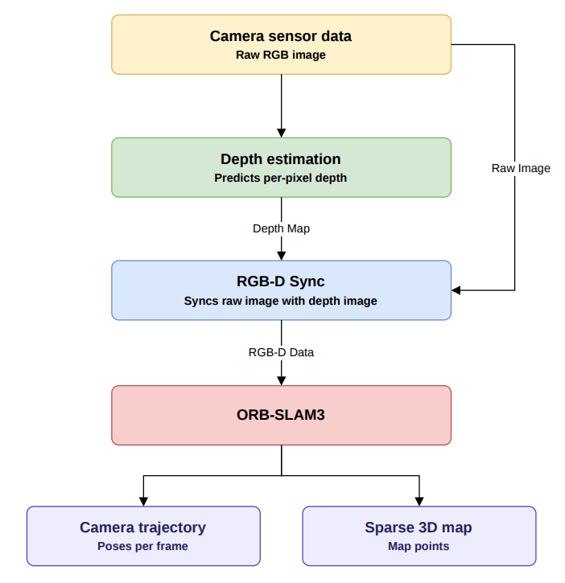

# Visual SLAM with Monocular Metric Depth Estimation

A ROS 2 pipeline that estimates dense metric depth from a monocular camera using Depth Anything V2, then feeds the generated RGB-D stream into ORB-SLAM3 for real-time visual SLAM. The system is evaluated on the KITTI Odometry dataset by comparing the estimated camera trajectories against the available ground-truth poses.

## Demo

### 1. Monocular Metric Depth Estimation

Depth estimation from a single RGB image.

<p align="center">
  
</p>

---

### 2. Visual SLAM

ORB-SLAM3 running on the generated RGB-D stream. (Visualization may take a few seconds to load.)
<p align="center">
  
</p>

---

### 3. Estimated vs Ground Truth Trajectory

<p align="center">
  
</p>

## Architecture
<p align="center">
  
</p>

## Installation

ORB-SLAM3 is included as a git submodule inside the `external/` directory.

Clone the repository with submodules:

```bash
git clone --recursive https://github.com/mhatre-shubham/RGBD_Visual_SLAM.git
```

Install dependencies and build ROS 2 Package
```bash
colcon build --packages-select rgbd_slam
source install/setup.bash
```

## Running the Pipeline
Start the ROS 2 pipeline:
```bash
ros2 launch rgbd_slam pipeline_launch.py
```

Running ORB-SLAM3
```bash
cd external/ORB_SLAM3

./Examples/RGB-D/rgbd_tum \
Vocabulary/ORBvoc.txt \
Examples/RGB-D/KITTI_RGBD.yaml \
/path/to/dataset/ \
/path/to/generated_dataset/associations.txt
```

## Running without ROS 2 (Offline Pipeline)
The project can also be executed without ROS2. This workflow processes an image sequence offline, generates metric depth maps, creates an RGB-D dataset compatible with ORB-SLAM3, and evaluates the estimated trajectory.

### Step 1: Generate Metric Depth Maps

```bash
python3 scripts/offline_depth_estimation.py
```

### Step 2: Create RGB-Depth Associations

```bash
python3 scripts/create_association.py
```

### Step 3: Run ORB-SLAM3

```bash
cd external/ORB_SLAM3

./Examples/RGB-D/rgbd_tum \
Vocabulary/ORBvoc.txt \
Examples/RGB-D/KITTI_RGBD.yaml \
/path/to/dataset/ \
/path/to/generated_dataset/associations.txt
```

### Step 4: Evaluate the Trajectory

```bash
python scripts/plot_trajectory.py
```

## Repository Structure

```
RGBD_Visual_SLAM/
│
├── rgbd_slam/                        # ROS 2 package
│   │
│   ├── src/                       
│   │   ├── kitti_publisher.py        # Publishes KITTI RGB images
│   │   ├── depth_anything_node.py    # Depth Anything V2 inference
│   │   └── slam_rgbd_sync_node.cpp   # Synchronizes RGB and dept images for RGB-D SLAM
│   │
│   ├── launch/                       # ROS 2 launch file
│   │   └── pipeline_launch.py      
│   │
│   ├── CMakeLists.txt                # ROS 2 build configuration
│   └── package.xml                   # ROS 2 package metadata
│
├── external/                       
│   └── ORB_SLAM3/                    # ORB-SLAM3 as git submodule
│
├── scripts/                          
│   ├── offline_depth_estimation.py   # Generate metric depth images using Depth Anything V2
│   ├── create_association.py         # Create RGB-depth timestamp associations for ORB-SLAM3
│   ├── plot_trajectory.py            # Compare estimated trajectory with KITTI ground truth
│   └── visualize_depth_estimation.py # Generate RGB-depth visualization videos for depth evaluation
│
├── results/                          # Experimental results and visualizations
│   ├── depth_estimation.gif        
│   ├── visual_slam.gif               
│   └── trajectory_comparison.png     
│
├── README.md                         
└── .gitignore
```
